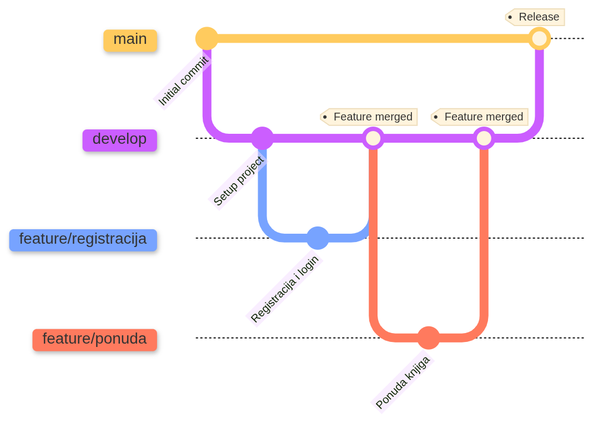

<div align="center">
  

# 📚 HonNoMachi (本の街 - Grad knjiga)

[](https://developer.android.com/)
[](https://kotlinlang.org/)
[](https://developer.android.com/jetpack/compose)
[](https://firebase.google.com/)
[]()

**HonNoMachi** je Android aplikacija namijenjena ljubiteljima knjiga. Omogućuje registriranim korisnicima da postanu dio zajednice u kojoj mogu prodavati knjige koje im više ne trebaju i otkrivati nove naslove za svoju kolekciju.

[📖 Dokumentacija](https://25-26-izvanredni-tim.atlassian.net/wiki/spaces/HNMT/overview) • [🐛 Prijavi Bug]() • [📋 Product Backlog List](https://25-26-izvanredni-tim.atlassian.net/jira/software/projects/HNM/list)
</div>

---

## 📋 Sadržaj

- [O projektu](#-o-projektu)
- [Tech Stack](#-tech-stack)
- [Preduvjeti](#-preduvjeti)
- [Instalacija](#-instalacija)
- [Funkcionalnosti](#-funkcionalnosti)
- [Contributing](#-contributing)
- [Dokumentacija](#-dokumentacija)
- [Tim](#-tim)

---

## 🎯 O projektu

HonNoMachi (本の街 - "Grad knjiga") je mobilna platforma koja spaja kupce i prodavače rabljenih knjiga. Aplikacija pruža intuitivno korisničko iskustvo s fokusom na sigurnost transakcija i jednostavnost korištenja.

**Ključne značajke:**
- 🔐 Sigurna autentifikacija korisnika (Email/Lozinka, Google OAuth)
- 📚 Pretraživanje i filtriranje knjiga po nazivu, žanru i autoru
- 🛒 Košarica s integriranim plaćanjem
- 💰 Simulacija plaćanja putem Stripe integracije
- 👤 Upravljanje korisničkim profilom
- 🛡️ Administratorski panel za moderaciju

---

## 🔧 Tech Stack

| Kategorija | Tehnologija |
|------------|-------------|
| **Jezik** | Kotlin |
| **UI Framework** | Jetpack Compose + Material Design 3 |
| **Arhitektura** | MVVM (Model-View-ViewModel) |
| **Backend** | Firebase (Authentication, Firestore, Cloud Functions) |
| **Plaćanje** | Stripe Android SDK (simulacija) |
| **Async Operations** | Kotlin Coroutines + Flow |
| **Dependency Injection** | Manual / Hilt (planirano) |
| **Version Control** | Git / GitHub (Git Flow workflow) |
| **CI/CD** | GitHub Actions (planirano) |
| **Project Management** | Jira + Confluence |

---

## ⚙️ Preduvjeti

Prije nego započnete s instalacijom, provjerite imate li sljedeće:

- **Android Studio** Ladybug (2024.2.1) ili novije
- **JDK** 17 ili novije
- **Android SDK** s minimalno API 24 (Android 7.0 Nougat)
- **Git** instaliran na računalu
- **Firebase projekt** (ili pristup postojećem projektu tima)
- **Google Play Services** na uređaju/emulatoru

---

## 📥 Instalacija

### 1. Kloniranje repozitorija

```bash
git clone https://github.com/25-26-izvanredni-tim/HonNoMachi.git
cd HonNoMachi
```

### 2. Firebase konfiguracija

> ⚠️ **Važno:** Datoteka `google-services.json` nije uključena u repozitorij zbog sigurnosnih razloga.

**Opcija A:** Zatražite datoteku od člana tima putem sigurnog kanala.

**Opcija B:** Preuzmite iz Firebase konzole:
1. Prijavite se na [Firebase Console](https://console.firebase.google.com/)
2. Odaberite projekt **HonNoMachi**
3. Idite na Project Settings → Your apps → Android app
4. Preuzmite `google-services.json`
5. Premjestite datoteku u `app/` direktorij projekta

### 3. Sinkronizacija i pokretanje

1. Otvorite projekt u Android Studiju
2. Kliknite **Sync Now** za sinkronizaciju Gradle datoteka
3. Povežite Android uređaj ili pokrenite emulator
4. Kliknite **Run 'app'** ili koristite `Shift + F10`

### 📖 Detaljne upute

Za detaljnije upute o postavljanju projekta, pogledajte:
👉 **[Development Setup - Confluence](https://25-26-izvanredni-tim.atlassian.net/wiki/x/DIDE)**

---

## 📱 Funkcionalnosti

### ✅ Implementirano (Sprint 01 - Pri Završetku)

#### 🔐 Autentifikacija korisnika
| Funkcionalnost | Status | Opis |
|----------------|--------|------|
| Registracija (Email/Lozinka) | ✅ | Kreiranje računa s validacijom podataka |
| Email verifikacija | ✅ | Firebase Authentication verifikacijski tok |
| Prijava/Odjava | ✅ | Sigurna autentifikacija postojećih korisnika |
| Validacija forme | ✅ | Real-time provjera email formata i politike lozinke |
| Ponovno slanje verifikacije | ✅ | Opcija za slanje novog verifikacijskog emaila |
| Pohrana korisnika (Firestore) | ✅ | Spremanje korisničkih podataka u bazu |

### 🚧 Planirano (Sprint 02+)

#### 🔐 Autentifikacija
- [ ] Google OAuth prijava (Gmail račun)
- [ ] Reset lozinke (zaboravljena lozinka)

#### 📚 Upravljanje knjigama
- [ ] Pregled svih dostupnih knjiga (HomePage)
- [ ] Pretraga i filtriranje (naziv, žanr, autor)
- [ ] Detaljni pregled pojedine knjige
- [ ] Kreiranje nove ponude knjige za prodaju
- [ ] Upravljanje vlastitim ponudama (aktivne/neaktivne)

#### 🛒 Kupovina
- [ ] Dodavanje knjiga u košaricu
- [ ] Pregled košarice s izračunom ukupnog iznosa
- [ ] Stripe integracija za simulaciju plaćanja
- [ ] Potvrda narudžbe i sažetak plaćanja
- [ ] Portfelj kupljenih knjiga (Moja knjižnica)

#### 👤 Korisnički profil
- [ ] Ažuriranje podataka (ime, kontakt, adresa)
- [ ] Promjena lozinke

#### 🛡️ Administrator panel
- [ ] Pregled i upravljanje korisnicima
- [ ] Suspenzija/reaktivacija korisničkih računa
- [ ] Pregled i upravljanje svim knjigama u ponudi

---

## 🤝 Contributing

Projekt koristi **Git Flow** workflow sa sljedećom strukturom grana:

### Workflow
1. Kreirajte novu granu iz `develop`
2. Implementirajte promjene
3. Kreirajte Pull Request prema `develop`
4. Zatražite code review od barem jednog člana tima
5. Nakon odobrenja, merge u `develop`



---

## 📚 Dokumentacija

Kompletan **Project Wiki** dostupan je na Confluence:

👉 **[HonNoMachi Confluence Space](https://25-26-izvanredni-tim.atlassian.net/wiki/spaces/HNMT/overview)**

### Ključne stranice

| Dokument | Opis |
|----------|------|
| [Project Overview](https://25-26-izvanredni-tim.atlassian.net/wiki/x/AQCb) | Pregled projekta i ciljevi |
| [System Architecture](https://25-26-izvanredni-tim.atlassian.net/wiki/x/DYDN) | Dijagram arhitekture sustava |
| [Development Setup](https://25-26-izvanredni-tim.atlassian.net/wiki/x/DIDE) | Upute za postavljanje projekta |
| [Product Backlog](https://25-26-izvanredni-tim.atlassian.net/wiki/x/BQCh) | Lista svih User Storyja |
| [Korisnička dokumentacija](https://25-26-izvanredni-tim.atlassian.net/wiki/x/AYD6AQ) | Upute za korištenje aplikacije |
| [UX Design](https://25-26-izvanredni-tim.atlassian.net/wiki/x/F4DJ) | Wireframovi i dizajn smjernice |

### Sprint dokumentacija
- [Sprint 01 Folder](https://25-26-izvanredni-tim.atlassian.net/wiki/spaces/HNMT/folder/10158102)

---

## 👥 Tim

Projekt razvija tim studenata **Fakulteta organizacije i informatike (FOI)**, Varaždin.

| Član | Email | Uloga |
|------|-------|-------|
| **Ivan Giljević** | igiljevic@student.foi.hr | Developer |
| **Denis Kuzminski** | dkuzminsk22@student.foi.hr | Developer |
| **Zlatko Pračić** | zpracic@student.foi.hr | Developer |
| **Mislav Žnidarec** | mznidarec@foi.hr | Developer |

📧 **Kontakt tima:** [Confluence - Informacije o timu](https://25-26-izvanredni-tim.atlassian.net/wiki/x/BACg)

---

<div align="center">

**Kolegij:** Analiza i razvoj programa  
**Akademska godina:** 2025/2026  
**Institucija:** Fakultet organizacije i informatike, Varaždin

---

**Status projekta:** 🟢 Sprint 01 - Završava se | Sprint 02 - U planiranju  
**Zadnje ažuriranje:** 25.11.2025

</div>
