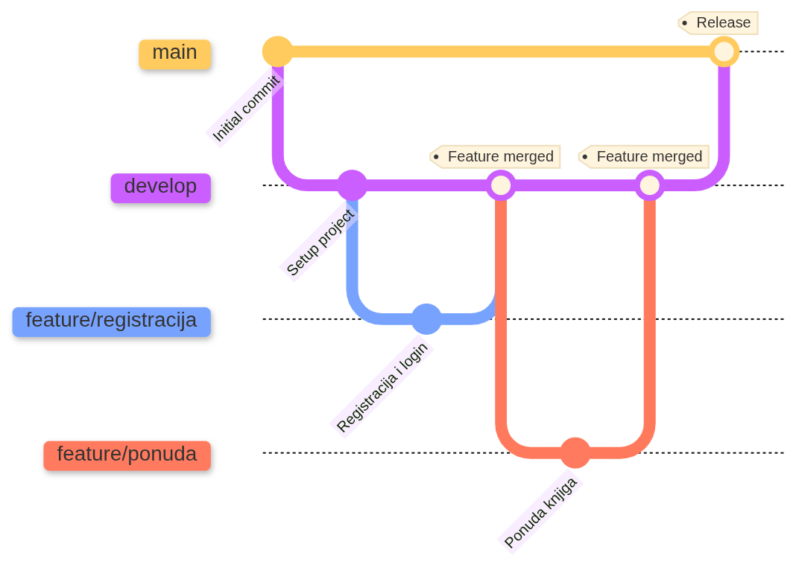

<div align="center">
  

# 📚 HonNoMachi (本の街 - Grad knjiga)

[](https://developer.android.com/)
[](https://kotlinlang.org/)
[](https://developer.android.com/jetpack/compose)
[](https://firebase.google.com/)
[]()

**HonNoMachi** je Android aplikacija namijenjena ljubiteljima knjiga. Omogućuje registriranim korisnicima da postanu dio zajednice u kojoj mogu prodavati knjige koje im više ne trebaju i otkrivati nove naslove za svoju kolekciju.

[📖 Dokumentacija](https://25-26-izvanredni-tim.atlassian.net/wiki/spaces/HNMT/overview) • [🐛 Prijavi Bug](https://github.com/bujin2502/HonNoMachi/issues) • [📋 Product Backlog List](https://25-26-izvanredni-tim.atlassian.net/jira/software/projects/HNM/list)
</div>

---

## Sadržaj

- [O projektu](#o-projektu)
- [Tech Stack](#tech-stack)
- [Preduvjeti](#preduvjeti)
- [Instalacija](#instalacija)
- [Funkcionalnosti](#funkcionalnosti)
- [Contributing](#contributing)
  - [Workflow](#workflow)
- [DevOps](#devops)
  - [Planiranje](#1-planiranje)
  - [Verzioniranje programskog koda](#2-verzioniranje-programskog-koda)
  - [Izgradnja](#3-izgradnja)
  - [Kontinuirana integracija (CI)](#4-kontinuirana-integracija-ci)
  - [Automatsko testiranje](#5-automatsko-testiranje)
  - [Kontinuirana isporuka (CD)](#6-kontinuirana-isporuka-cd)
  - [Analiza kvalitete programskog koda](#7-analiza-kvalitete-programskog-koda)
  - [Upravljanje konfiguracijom](#8-upravljanje-konfiguracijom)
  - [Nadgledanje (Operate & Monitor)](#9-nadgledanje-operate--monitor)
- [Dokumentacija](#dokumentacija)
- [Tim](#tim)

---

## O projektu

HonNoMachi (本の街 - "Grad knjiga") je mobilna platforma koja spaja kupce i prodavače rabljenih knjiga. Aplikacija pruža intuitivno korisničko iskustvo s fokusom na sigurnost transakcija i jednostavnost korištenja.

**Ključne značajke:**
- Sigurna autentifikacija korisnika (Email/Lozinka, Google OAuth)
- Pretraživanje i filtriranje knjiga po nazivu, žanru i autoru
- Košarica s integriranim plaćanjem
- Simulacija plaćanja putem Stripe integracije
- Upravljanje korisničkim profilom
- Administratorski panel za moderaciju

---

## Tech Stack

| Kategorija               | Tehnologija                                           |
|--------------------------|-------------------------------------------------------|
| **Jezik**                | Kotlin                                                |
| **UI Framework**         | Jetpack Compose + Material Design 3                   |
| **Arhitektura**          | MVVM (Model-View-ViewModel)                           |
| **Backend**              | Firebase (Authentication, Firestore, Storage)         |
| **Plaćanje**             | Stripe Android SDK (simulacija)                       |
| **Async Operations**     | Kotlin Coroutines + Flow                              |
| **Dependency Injection** | Hilt                                                  |
| **Version Control**      | Git / GitHub (Git Flow workflow)                      |
| **CI/CD**                | GitHub Actions                                        |
| **Project Management**   | Jira + Confluence                                     |

---

## Preduvjeti

Prije nego započnete s instalacijom, provjerite imate li sljedeće:

- **Android Studio** Ladybug (2024.2.1) ili novije
- **JDK** 17 ili novije
- **Android SDK** s minimalno API 26 (Android 8.0 Oreo)
- **Git** instaliran na računalu
- **Firebase projekt** (ili pristup postojećem projektu tima)
- **Google Play Services** na uređaju/emulatoru

---

## Instalacija

### 1. Kloniranje repozitorija

```bash
git clone https://github.com/25-26-izvanredni-tim/HonNoMachi.git
cd HonNoMachi
```

### 2. Firebase konfiguracija

> **Važno:** Datoteka `google-services.json` nije uključena u repozitorij zbog sigurnosnih razloga.

**Opcija A:** Zatražite datoteku od člana tima putem sigurnog kanala.

**Opcija B:** Preuzmite iz Firebase konzole:
1. Prijavite se na [Firebase Console](https://console.firebase.google.com/)
2. Odaberite projekt **HonNoMachi**
3. Idite na Project Settings → Your apps → Android app
4. Preuzmite `google-services.json`
5. Premjestite datoteku u `app/` direktorij projekta

### 3. Stripe konfiguracija (test okruženje)

1. U `local.properties` dodajte:
   `STRIPE_PUBLISHABLE_KEY=pk_test_...`
2. U CI okruženju postavite varijablu:
   `STRIPE_PUBLISHABLE_KEY=pk_test_...`
3. Nikada ne stavljajte Stripe secret key (`sk_...`) u Android aplikaciju
4. Backend secret-e za Cloud Functions postavite preko Firebase CLI:
   `npx firebase-tools functions:secrets:set STRIPE_SECRET_KEY --project <firebase-project-id>`
   `npx firebase-tools functions:secrets:set STRIPE_WEBHOOK_SECRET --project <firebase-project-id>`
   `npx firebase-tools functions:secrets:set STRIPE_WALLET_WEBHOOK_SECRET --project <firebase-project-id>`
5. Deploy backend funkcija (PowerShell: navodnici oko `--only`):
   `npx firebase-tools deploy --only "functions:createCheckoutPaymentIntent,functions:addToCartAndReserve,functions:removeFromCartAndRelease,functions:cancelCheckout,functions:releaseExpiredCheckoutSessions,functions:releaseExpiredCartReservations,functions:createWalletTopupIntent,functions:stripeWebhook,functions:stripeWalletWebhook" --project <firebase-project-id>`
6. U Stripe Dashboardu dodajte checkout webhook endpoint:
   `https://us-central1-<firebase-project-id>.cloudfunctions.net/stripeWebhook`
   i uključite evente:
   `payment_intent.succeeded`, `payment_intent.payment_failed`, `payment_intent.canceled`
7. U Stripe Dashboardu dodajte wallet webhook endpoint:
   `https://us-central1-<firebase-project-id>.cloudfunctions.net/stripeWalletWebhook`
   i uključite evente:
   `payment_intent.succeeded`, `payment_intent.payment_failed`, `payment_intent.canceled`, `charge.refunded`

### 4. Sinkronizacija i pokretanje

1. Otvorite projekt u Android Studiju
2. Kliknite **Sync Now** za sinkronizaciju Gradle datoteka
3. Povežite Android uređaj ili pokrenite emulator
4. Kliknite **Run 'app'** ili koristite `Shift + F10`

Ako pokrećete Gradle iz terminala:

```powershell
# Windows PowerShell
.\gradlew.bat :app:assembleDebug
```

```bash
# Bash / Git Bash
./gradlew :app:assembleDebug
```

### Detaljne upute

Za detaljnije upute o postavljanju projekta, pogledajte:
**[Development Setup - Confluence](https://25-26-izvanredni-tim.atlassian.net/wiki/x/DIDE)**

---

## Funkcionalnosti

### Sprint 01

#### Autentifikacija korisnika
- [x] Registracija putem Email/Lozinka s validacijom podataka
- [x] Email verifikacija (Firebase Authentication verifikacijski tok)
- [x] Prijava/Odjava — sigurna autentifikacija postojećih korisnika
- [x] Validacija forme (real-time provjera email formata i politike lozinke)
- [x] Ponovno slanje verifikacijskog emaila
- [x] Pohrana korisničkih podataka u Firestore bazu

### Sprint 02

#### Autentifikacija
- [x] Google OAuth prijava/registracija (Firebase Auth + Credential Manager)

#### Upravljanje knjigama
- [x] Pregled svih dostupnih knjiga (HomePage s LazyColumn)
- [x] Pretraga po naslovu s dinamičkim filtriranjem
- [x] Detaljni pregled pojedine knjige (galerija slika, svi podaci)

#### Korisnički profil
- [x] Ažuriranje podataka (ime, prezime, kontakt, adresa)
- [x] Promjena lozinke (validacija jačine + poništavanje sesija)
- [x] Promjena e-maila uz sigurnosne korake (ponovna verifikacija)

#### Kvaliteta i stabilnost
- [x] Lokalizacija EN/HR (string resursi, enumi: BookGenre, BookCondition, Currency)
- [x] Lint korak dodan u CI pipeline prije builda

### Sprint 03

#### Kreiranje ponude knjige
- [x] Model podataka za ponude (naslov, autor, žanr, godina, izdavač, opis, stanje, cijena, slike)
- [x] UI za kreiranje i uređivanje ponuda s upravljanjem stanjima (loading/saving/error)
- [x] ViewModel i business logika za upravljanje ponudama
- [x] Unit testovi za validaciju i business logiku

#### Košarica
- [x] CartItemModel i CartRepository s Firestore integracijom (real-time snapshotListener)
- [x] Dodavanje u košaricu s prevencijom dupliciranja
- [x] Pregled košarice, brisanje artikala i prikaz ukupne cijene (CartPage)
- [x] Indikator košarice (BadgedBox) s real-time ažuriranjem badge-a
- [x] CartViewModel s Hilt DI i upravljanjem stanjima (Loading/Success/Error)

#### Firebase Crashlytics
- [x] Setup i integracija Firebase Crashlytics (plugin, konzola, Version Catalog)
- [x] CrashlyticsManager za centralizirano hvatanje non-fatal grešaka
- [x] Automatsko praćenje trenutnog ekrana i prijavljenog korisnika (userId)
- [x] Pristanak korisnika na analitiku i Crashlytics (GDPR)
- [x] Firebase Alerts i Slack notifikacije za crash izvještaje

#### Unapređenje arhitekture (MVVM + SOLID)
- [x] Reorganizacija paketa (ui/, data/, di/)
- [x] Hilt setup (@HiltAndroidApp, @AndroidEntryPoint, AppModule)
- [x] Refaktoriranje Firebase logike u repozitorije (AuthRepository, BookRepository)
- [x] ViewModeli s @HiltViewModel i UiState data klasama po ekranu

### Sprint 04

#### Modularnost učitavanja slika
- [x] Izdvojen image_uploader modul za prijenos slika (Firebase Storage)
- [x] ImageUploader sučelje s FirebaseImageUploader implementacijom
- [x] Result sealed klasa za upravljanje pogreškama (success/error)
- [x] ImageUploaderModule s Hilt DI
- [x] Konfiguracija Firebase Storage pravila i ažuriranje dozvola u AndroidManifest.xml

### Sprint 05

### Sprint 06

### Sprint 07

---

## Contributing

Projekt koristi **Git Flow** workflow sa sljedećom strukturom grana:

### Workflow
1. Kreirajte novu granu iz `develop`
2. Implementirajte promjene
3. Kreirajte Pull Request prema `develop`
4. Zatražite code review od barem jednog člana tima
5. Nakon odobrenja, merge u `develop`

<div align="center">
  
</div>

---

## DevOps

Projekt koristi DevOps prakse za automatizaciju procesa razvoja, testiranja i isporuke.

### 1. Planiranje

- [x] **Jira** za upravljanje projektom i praćenje zadataka
- [x] **Firebase Rules** — upravljanje pravilima autentifikacije, Firestore baze i Storage-a ručno putem Firebase konzole (bez Firebase CLI / Infrastructure as Code pristupa)

### 2. Verzioniranje programskog koda

- [x] **Git** kao sustav za kontrolu verzija s **Git Flow** workflow strategijom
- [x] **GitHub** kao udaljeni repozitorij i platforma za suradnju
- [x] Struktura grana: `master` (produkcija), `develop` (razvoj), `feature/*`, `bugfix/*`, `release/*`
- [x] Obvezni **Pull Requesti** s code reviewom prije merga u `develop`

### 3. Izgradnja

- [x] **Gradle (Kotlin DSL)** kao sustav za izgradnju projekta
- [x] Automatska izgradnja **Debug APK-a** unutar CI pipeline-a na svakom push-u i PR-u
- [x] Automatska izgradnja **Release APK-a** pri push-u na `master` granu
- [x] Konfiguracija: `compileSdk = 36`, `minSdk = 26`, `targetSdk = 36`, `JDK 17`

### 4. Kontinuirana integracija (CI)

CI pipeline pokreće se automatski na svakom `push` i `pull request` prema `master` i `develop` granama putem **GitHub Actions**. Pipeline uključuje:

| Korak | Opis | Ovisi o |
|-------|------|---------|
| **Lint provjera** | KTlint i Android Lint analiza koda | - |
| **Unit testovi** | Pokretanje unit testova s generiranjem JaCoCo izvještaja o pokrivenosti koda | - |
| **SonarCloud analiza** | Statička analiza koda, code smells, bugovi, sigurnosni propusti i prikaz pokrivenosti koda | Unit testovi |
| **Build Debug APK** | Kompilacija debug verzije aplikacije | Lint provjera, Unit testovi |
| **Build Release APK** | Kompilacija release verzije (samo pri push-u na `master`) | Lint provjera, Unit testovi |

- [x] **Concurrency control** — upravljanje istovremenim pokretanjima pipeline-a za istu granu

### 5. Automatsko testiranje

- [x] **JUnit** za unit testove
- [x] **MockK** za mockiranje ovisnosti u testovima
- [x] **Fake Repository** — lažne implementacije repozitorija za izolirano testiranje bez vanjskih ovisnosti
- [x] **Jetpack Compose Testing** (`ui-test-junit4`) za testiranje UI komponenti
- [x] **Espresso** za instrumentacijske (androidTest) testove
- [x] **Coroutines Test** (`kotlinx-coroutines-test`) za testiranje asinkronog koda
- [x] **Navigation Testing** za testiranje navigacijskih tokova
- [x] Automatsko pokretanje testova u CI pipeline-u na svakom push-u i PR-u

### 6. Kontinuirana isporuka (CD)

> **U planiranju** — CD pipeline još nije implementiran.

Planirane aktivnosti za kontinuiranu isporuku:
- [ ] Automatsko potpisivanje release APK-a (keystore putem GitHub Secrets)
- [ ] Distribucija putem Firebase App Distribution za interni QA
- [ ] Automatski deployment na Google Play (Internal Testing track)
- [ ] Verzioniranje buildova na temelju Git tagova

### 7. Analiza kvalitete programskog koda

- [x] **KTlint** — statička analiza i provjera stila Kotlin koda prema službenim konvencijama
- [x] **Android Lint** — detekcija potencijalnih bugova, sigurnosnih propusta i performansnih problema
- [x] **JaCoCo** — generiranje izvještaja o pokrivenosti koda testovima (XML + HTML)
- [x] **SonarCloud** — kontinuirana inspekcija kvalitete koda (statička analiza, code smells, bugovi, sigurnosni propusti) s integracijom JaCoCo izvještaja za prikaz pokrivenosti koda
- [x] Upload lint i JaCoCo izvještaja kao CI artefakata za pregled nakon svakog builda

### 8. Upravljanje konfiguracijom

- [x] **GitHub Secrets** za sigurno pohranjivanje osjetljivih podataka (`GOOGLE_SERVICES_JSON`, `SONAR_TOKEN`)
- [x] **Gradle Kotlin DSL** (`build.gradle.kts`) za deklarativnu konfiguraciju projekta i ovisnosti
- [x] **Version Catalog** (`libs.versions.toml`) za centralizirano upravljanje verzijama biblioteka
- [x] `.gitignore` za isključivanje osjetljivih i generiranih datoteka iz repozitorija

### 9. Nadgledanje (Operate & Monitor)

#### Notifikacije i komunikacija

- [x] **GitHub-Slack integracija** — automatske obavijesti u Slack kanalu o push eventima, pull requestovima, code reviewovima i statusu CI pipeline-a

#### Praćenje performansi

Implementirani alati:
- [x] **Firebase Analytics** — praćenje korisničkih događaja i ponašanja unutar aplikacije
- [x] **Firebase Crashlytics** — automatsko prikupljanje i analiza crash izvještaja

Planirano:
- [ ] Integracija Firebase Performance Monitoring za praćenje vremena pokretanja aplikacije, mrežnih zahtjeva i sporog renderiranja
- [ ] Postavljanje alertova za kritične performansne metrike (ANR rate, crash rate)

---

## Dokumentacija

Kompletan **Project Wiki** dostupan je na Confluence:

**[HonNoMachi Confluence Space](https://25-26-izvanredni-tim.atlassian.net/wiki/spaces/HNMT/overview)**

### Ključne stranice

| Dokument                                                                             | Opis                           |
|--------------------------------------------------------------------------------------|--------------------------------|
| [Project Overview](https://25-26-izvanredni-tim.atlassian.net/wiki/x/AQCb)           | Pregled projekta i ciljevi     |
| [System Architecture](https://25-26-izvanredni-tim.atlassian.net/wiki/x/DYDN)        | Dijagram arhitekture sustava   |
| [Development Setup](https://25-26-izvanredni-tim.atlassian.net/wiki/x/DIDE)          | Upute za postavljanje projekta |
| [Product Backlog](https://25-26-izvanredni-tim.atlassian.net/wiki/x/BQCh)            | Lista svih User Storyja        |
| [Korisnička dokumentacija](https://25-26-izvanredni-tim.atlassian.net/wiki/x/AYD6AQ) | Upute za korištenje aplikacije |
| [UX Design](https://25-26-izvanredni-tim.atlassian.net/wiki/x/F4DJ)                  | Wireframovi i dizajn smjernice |

---

## Tim

Projekt razvija tim studenata **Fakulteta organizacije i informatike (FOI)**, Varaždin.

| Član                | Email                      | Uloga     |
|---------------------|----------------------------|-----------|
| **Ivan Giljević**   | igiljevic@student.foi.hr   | Developer |
| **Denis Kuzminski** | dkuzminsk22@student.foi.hr | Developer |
| **Zlatko Pračić**   | zpracic@student.foi.hr     | Developer |
| **Mislav Žnidarec** | mznidarec@student.foi.hr   | Developer |

---

<div align="center">

**Kolegij:** Analiza i razvoj programa  
**Akademska godina:** 2025/2026  
**Institucija:** Fakultet organizacije i informatike, Varaždin

---

**Status projekta:** Sprint 05 - U tijeku | Sprint 06 - U planiranju
**Zadnje ažuriranje:** 13.02.2026.

</div>
